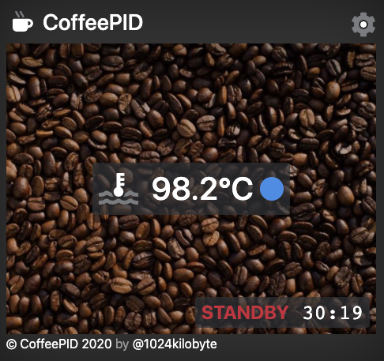

# CoffeePID

An ESP8266 / Arduino based "PID" controller for your coffee machine controlled via a web interface. 

Besides a really precise temperature control CoffeePID adds software based overheating protection and a standby mode (currently activated after 30 minutes uptime).

## Overview

There are already a lot of similar projects out there, but the main difference(s) of CoffeePID are:
- the PT1000 thermo element to measure the temperature (more precise than a type k thermocouple)
- the complete invisi- and reversible build, controlled by a web interface

I wrote a whole blog series about this project. If you want to learn more about the details regarding components and software, you may want to take a look:
- [project idea and hardware choice](https://1024kilobyte.com/blog/2020/3/3/new-project-coffeepid-a-generic-pid-controller-for-coffee-machines)
- [writing the arduino code](https://1024kilobyte.com/blog/2020/3/3/coffeepid-the-software)
- [creating the web interface](https://1024kilobyte.com/blog/2020/8/2/coffeepid-the-web-interface)
- [putting everything together](https://1024kilobyte.com/blog/2020/7/22/coffeepid-the-build)
- optimizing the project (work in progress)

## Hardware Setup

The project contains of 4 main components
- an ESP8266 microcontroller board (with minor modifications other boards will work also)
- a MAX31865 breakout board with a PT1000 thermo element
- a SSR-25DA relay (pin variable "relayPin" in code)
- a 3,3 V power supply

The MAX31865 is connected via SPI to the ESP8266, the pinout is defined in the header of the arduino file. You can also set the relay pin there.

## Wiring

To integrate CoffeePID you only need 230V for the power supply and replace the thermostat with the SSR. The wiring and placement of the project inside my Gaggia Classic is described in this [blog post](https://1024kilobyte.com/blog/2020/7/22/coffeepid-the-build). If you have a different coffee machine, you will have to adapt the wiring to your make and model. But I hope reading about my journey may help you to do this.

# Setup / Install

As the project is based on the Arduino environment, you need to install some prerequisites to use this project. Those are:

- Arduino IDE
- ESP8266-extension to the Arduino IDE
- LittleFS-extension to the Arduino IDE

You should then be able to checkout this project and open the "CoffeePID.ino"-file in your Arduino IDE. Then if a compatible ESP8266-board is connected, you should be able to transfer the data-folder to the LittleFS area (Tools-menu: ESP8266 LittleFS Data Upload). And finally you just have to transfer the sketch to the ESP via the upload button in the Arduino IDE. On first startup the CoffeePID is starting its own wifi called "CoffeePID", the password is "coffeepid", you may take a look at the serial monitor to check for any issues. After connecting to this network the ESP can be reached via the url [http://coffeepid.local](http://coffeepid.local). You can change the wifi settings in the settings tab of the website.

To simplify the usage I created two QR codes you can use to connect to the CoffeePID wifi and then visit its homepage. You can print them and place them somewhere close to your coffee machine for even quicker access to CoffeePID. If you change the accesspoint settings you obviously have to create your own QR code to connect.

## QR Code to connect to the Wifi

## QR Code to open the CoffeePID frontend

# Development

As the webserver is optimized to only deliver *.gz-compressed files you have to re-compress any file after you changed it. To make this more convenient I added a shell-script to the root of the project called "optimize.sh". It should work without any changes on Mac and Linux systems, as long as you have the used tools installed, like purgecss and uglifycss. Before executing the script you need to unpack the "app.html.gz" to "app.html" inside the "www"-folder.